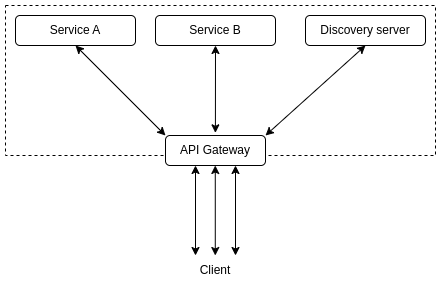
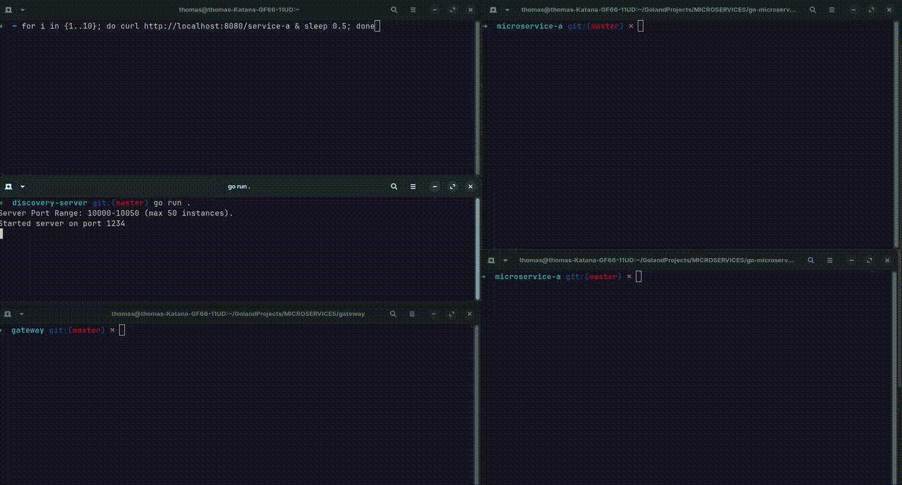
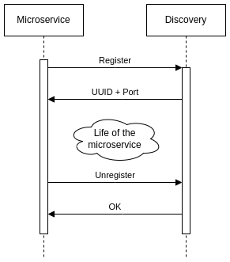

# Go microservices architecture

This page is the home of the **Go microservices architecture**. It's a personal project made in Golang, which consists of a simple microservice architecture, with :

* a discovery server
* an API gateway
* a sample microservice

This project remains very simple, however a microservice can be launched multiple times at once.

## Quick demo

Here is a quick demo with two instances of `service-a` :

## Microservice lifecycle

This is how a microservice lives, from its startup to its shutdown :

